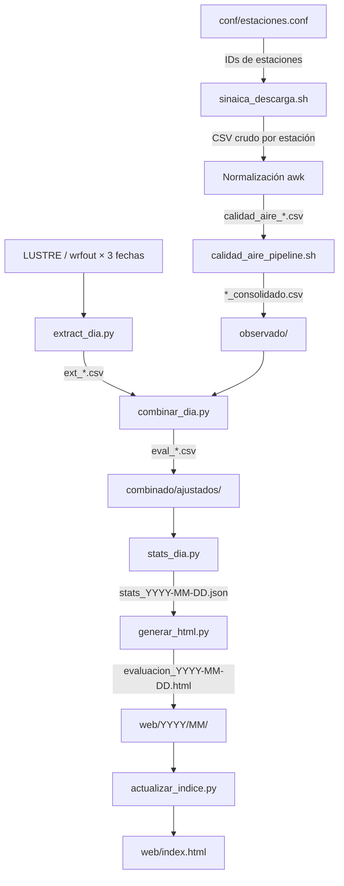

# 🌫️ ddsinaica — Pipeline de Evaluación WRF-Chem vs SINAICA

[](#)
[](#)
[](#licencia)

Pipeline operativo de descarga, procesamiento y validación estadística del pronóstico de calidad del aire producido por **WRF-Chem**, comparado contra observaciones horarias de la red **SINAICA/INECC**. Cubre siete ciudades del centro de México y está diseñado para ejecutarse de forma autónoma mediante crontab, publicando resultados en una página web estática actualizada cada día.

---

## Tabla de Contenidos

- [Descripción](#descripción)
- [Arquitectura del flujo](#arquitectura-del-flujo)
- [Requisitos del sistema](#requisitos-del-sistema)
- [Dependencias](#dependencias)
- [Instalación](#instalación)
- [Configuración](#configuración)
- [Uso](#uso)
- [Estructura del repositorio](#estructura-del-repositorio)
- [Flujo de datos](#flujo-de-datos)
- [Manejo de errores](#manejo-de-errores)
- [Ciudades y contaminantes](#ciudades-y-contaminantes)
- [Métricas de validación](#métricas-de-validación)
- [Contribución](#contribución)
- [Licencia](#licencia)

---

## Descripción

El repositorio implementa dos modos de operación:

| Modo | Script principal | Propósito |
|------|-----------------|-----------|
| **Operativo diario** | `evaluacion_diaria.sh` | Ejecutado por crontab; descarga, procesa y publica el análisis del día anterior en HTML. |
| **Histórico mensual** | `01_extrae.py` | Procesamiento manual de un mes completo; genera reportes Word con Bootstrap. |

Desde la **v2.0.0**, la descarga de observaciones se realiza íntegramente con `sinaica_descarga.sh` (HTTP directo al endpoint de SINAICA), eliminando la dependencia de R y el paquete `rsinaica`.

---

## Arquitectura del flujo

```
╔══════════════════════════════════════════════════════════════════╗
║  OBSERVACIONES (SINAICA/INECC)                                   ║
║                                                                  ║
║  sinaica_descarga.sh                                             ║
║  POST https://sinaica.inecc.gob.mx/pags/datGrafs.php            ║
║  ┌─ por estación × contaminante × día ─┐                        ║
║  │  tmp/raw_sinaica/<fecha>/*.csv       │                        ║
║  └───────────────┬───────────────────  ┘                        ║
║                  ▼                                               ║
║  [Normalización al formato del pipeline]                         ║
║                  ▼                                               ║
║  calidad_aire_pipeline.sh                                        ║
║  ├─ salida/<Ciudad>_<Estacion>_<Cont>.csv                        ║
║  └─ consolidado/<Ciudad>_<Cont>_consolidado.csv                  ║
║                  │                                               ║
║                  └───────────► observado/  ◄──────────────────┐ ║
╚══════════════════════════════════════════════════════════════╗  │ ║
                                                               ║  │ ║
╔══════════════════════════════════════════════════════════════╝  │ ║
║  MODELO (WRF-Chem / LUSTRE)                                      │ ║
║                                                                  │ ║
║  wrfout_d01_YYYY-MM-DD_00:00:00 × 3 horizontes                   │ ║
║              │                                                   │ ║
╚══════════════╪═══════════════════════════════════════════════════╪═╝
               │                                                   │
               ▼                                                   │
  extract_dia.py  ─────────────────────────────────────────────────┘
  (O3 max espacial ppbv; PM10/PM2.5 prom. máx. µg/m³)
               │
               ▼
  combinar_dia.py
  (obs_max + mod_dia1/dia2/dia3 por ciudad)
               │
               ▼
  stats_dia.py  →  stats_YYYY-MM-DD.json
  (BIAS, RMSE, R; POD, FAR, CSI — ventana 30 días)
               │
       ┌───────┴──────────────┐
       ▼                      ▼
  generar_html.py        actualizar_indice.py
  web/YYYY/MM/           web/index.html
  evaluacion_YYYY-MM-DD.html
```

### Horizontes de pronóstico evaluados

Dado que cada run de WRF-Chem produce 72 h de pronóstico, el día de evaluación (`FECHA_EVAL = ayer`) está cubierto por tres runs distintos:

| Variable | Fecha del run | Horizonte | Ventana temporal local |
|----------|--------------|-----------|------------------------|
| `RUN_D1` | Ayer | +24 h (día 1) | Índices 6–29 del wrfout |
| `RUN_D2` | Antier | +48 h (día 2) | Índices 30–53 del wrfout |
| `RUN_D3` | Antes de ayer | +72 h (día 3) | Índices 54–71 del wrfout |

---

## Requisitos del sistema

| Componente | Versión mínima | Notas |
|------------|---------------|-------|
| bash | 4.0 | Arrays asociativos (`declare -A`) |
| curl | 7.x | Peticiones HTTP a SINAICA |
| python3 | 3.8 | Scripts de análisis y visualización |
| awk, sort, sed | POSIX | Procesamiento de CSV en bash |

> **macOS**: bash instalado por defecto es la v3. Instalar `bash >= 4` con Homebrew:
> ```bash
> brew install bash
> ```
> Luego apuntar el crontab a `/usr/local/bin/bash`.

---

## Dependencias

### Python

```bash
pip install -r requirements.txt
```

**`requirements.txt`**:

```
xarray>=0.19
netCDF4>=1.5
pandas>=1.3
numpy>=1.21
matplotlib>=3.4
python-docx>=0.8
python-dateutil>=2.8
```

### Entorno reproducible (recomendado)

**Con venv**:

```bash
python3 -m venv .venv
source .venv/bin/activate
pip install -r requirements.txt
```

Configurar `PYTHON_BIN` en el entorno del crontab para apuntar al Python del venv:

```
# crontab -e
PYTHON_BIN=/opt/wrf/evaluacion/.venv/bin/python3
0 7 * * * /opt/wrf/evaluacion/evaluacion_diaria.sh >> ...
```

**Con conda**:

```bash
conda create -n wrf-eval python=3.11
conda activate wrf-eval
pip install -r requirements.txt
```

### Sin R (cambio respecto a v1.x)

A partir de la v2.0.0 **no se requiere R ni el paquete `rsinaica`**. La descarga se realiza directamente sobre el endpoint HTTP de SINAICA mediante `sinaica_descarga.sh`.

---

## Instalación

```bash
# 1. Clonar el repositorio
git clone https://github.com/JoseAgustin/ddsinaica.git
cd ddsinaica

# 2. Crear y activar entorno Python
python3 -m venv .venv
source .venv/bin/activate
pip install -r requirements.txt

# 3. Crear árbol de directorios de trabajo
#    (evaluacion_diaria.sh lo hace automáticamente en la primera ejecución,
#     pero se puede hacer manualmente para verificar permisos)
mkdir -p conf observado modelo combinado/ajustados logs tmp web/css

# 4. Dar permisos de ejecución a los scripts bash
chmod +x evaluacion_diaria.sh sinaica_descarga.sh calidad_aire_pipeline.sh

# 5. Editar las variables de configuración en la Sección 1 del script
#    Las dos variables obligatorias son:
#      DIR_PROYECTO   →  ruta absoluta del repositorio clonado
#      DIR_WRF        →  ruta del almacenamiento LUSTRE de salidas WRF-Chem
#    O bien exportarlas como variables de entorno:
export EVALUACION_DIR=/opt/wrf/evaluacion
export WRF_DIR=/LUSTRE/OPERATIVO/EXTERNO-salidas/WRF-CHEM
```

---

## Configuración

### Variables de entorno

| Variable | Descripción | Valor por defecto |
|----------|-------------|-------------------|
| `EVALUACION_DIR` | Ruta absoluta del proyecto | Directorio del script |
| `WRF_DIR` | Raíz de archivos wrfout de WRF-Chem | `/LUSTRE/OPERATIVO/EXTERNO-salidas/WRF-CHEM` |
| `PYTHON_BIN` | Ejecutable Python | `python3` |
| `SINAICA_TIPO` | Tipo de datos SINAICA | `""` (Crude/no validados) |

### Catálogo de estaciones (`conf/estaciones.conf`)

El script genera una plantilla en la primera ejecución. Editar con los IDs reales de cada estación:

```tsv
# ESTACION_ID  CIUDAD_WRF  CONT_SINAICA  NOMBRE_RED           NOMBRE_ESTACION
249            CDMX        O3            Valle de México       Merced
250            CDMX        PM10          Valle de México       Merced
501            Pachuca     O3            Pachuca               Primaria Ignacio Zaragoza
```

Los IDs numéricos de estación se obtienen en **https://sinaica.inecc.gob.mx** → Datos → buscar estación → el ID aparece en la URL (`estacionId=XXX`).

> **Nota**: Las líneas con `ID=999` son ejemplos de plantilla y se omiten automáticamente durante la descarga.

---

## Uso

### Modo automático (crontab)

```bash
# Evalúa el día anterior. Sin argumentos.
bash evaluacion_diaria.sh
```

**Instalación en crontab** (ejecutar a las 07:00 cada día):

```bash
crontab -e
```

```cron
# Variables de entorno para el pipeline
EVALUACION_DIR=/opt/wrf/evaluacion
WRF_DIR=/LUSTRE/OPERATIVO/EXTERNO-salidas/WRF-CHEM
PYTHON_BIN=/opt/wrf/evaluacion/.venv/bin/python3

# Evaluación diaria con log rotativo por fecha
0 7 * * * /opt/wrf/evaluacion/evaluacion_diaria.sh \
          >> /opt/wrf/evaluacion/logs/cron_$(date +\%Y\%m\%d).log 2>&1
```

### Modo reproceso (fecha específica)

```bash
# Reprocesar una fecha histórica
bash evaluacion_diaria.sh 2026-02-15

# Reprocesar con Python del venv
PYTHON_BIN=/opt/wrf/evaluacion/.venv/bin/python3 \
  bash evaluacion_diaria.sh 2026-02-15
```

En modo reproceso, si los CSV de SINAICA del día ya existen y tienen suficientes registros, se reutilizan (no se vuelven a descargar).

### Descarga individual con `sinaica_descarga.sh`

```bash
# O3 de la estación 249, un día, salida CSV
bash sinaica_descarga.sh -e 249 -p O3 -f 2026-02-24 -r 1dia -c

# PM10 validado para un mes completo
bash sinaica_descarga.sh -e 271 -p PM10 -f 2026-01-01 -r 1mes -t V -c -o pm10_ene.csv

# PM2.5 dos semanas, JSON a stdout
bash sinaica_descarga.sh -e 251 -p PM2.5 -f 2026-02-10 -r 2semanas

# Ayuda completa
bash sinaica_descarga.sh -h
```

### Verificar una ejecución

```bash
# Ver el log del día anterior
tail -100 logs/evaluacion_$(date -d yesterday +%Y-%m-%d).log

# Listar HTML generados este mes
ls -lh web/$(date +%Y)/$(date +%m)/

# Probar la cadena de procesamiento completa sin crontab
bash evaluacion_diaria.sh $(date -d yesterday +%Y-%m-%d)
```

---

## Estructura del repositorio

```
ddsinaica/
│
├── evaluacion_diaria.sh          # Orquestador diario (crontab)
├── sinaica_descarga.sh           # Descarga HTTP directa de SINAICA
├── calidad_aire_pipeline.sh      # Separación y consolidación de observaciones
├── 01_extrae.py                  # Pipeline histórico mensual (modo manual)
├── requirements.txt              # Dependencias Python
│
├── conf/
│   └── estaciones.conf           # Catálogo de estaciones SINAICA (TSV)
│
├── observado/                    # CSVs consolidados por ciudad (input del análisis)
│   ├── Valle_de_Mexico_O3_consolidado.csv
│   └── ...
│
├── modelo/                       # Series históricas del modelo WRF-Chem
│   ├── maximos_diarios_o3_CDMX.csv
│   └── ...
│
├── combinado/
│   ├── combinado_CDMX_O3.csv     # Obs + modelo sin ajuste
│   └── ajustados/
│       └── eval_o3_CDMX_YYYY-MM-DD.csv   # Un CSV por fecha evaluada
│
├── logs/
│   └── evaluacion_YYYY-MM-DD.log
│
├── tmp/                          # Scratch (se limpia al final de cada ejecución)
│   ├── raw_sinaica/
│   │   └── YYYY-MM-DD/
│   │       └── sinaica_<ID>_<Cont>_<Fecha>.csv
│   ├── pipeline_work/
│   │   ├── calidad_aire_<Ciudad>_<Estacion>.csv
│   │   ├── salida/
│   │   └── consolidado/
│   └── extraidos/
│       └── ext_<cont>_<ciudad>_h<n>.csv
│
└── web/                          # Sitio web estático
    ├── index.html                # Índice histórico de reportes
    ├── css/
    │   └── estilo.css
    └── YYYY/
        └── MM/
            └── evaluacion_YYYY-MM-DD.html
```

---

## Flujo de datos



---

## Manejo de errores

### Comportamiento ante fallos parciales

El script está diseñado para ser **tolerante a fallos parciales**: si un componente no está disponible, el proceso continúa con los datos que sí existen y registra la advertencia en el log.

| Situación | Comportamiento |
|-----------|---------------|
| 0 de 3 wrfout disponibles | **Aborta** con código 1 (fallo crítico) |
| 1 o 2 de 3 wrfout disponibles | Continúa; rellena con `NA` los horizontes faltantes |
| Descarga SINAICA fallida (3 reintentos) | Advertencia en log; continúa con observaciones previas en `observado/` |
| CSV con menos de 18 registros | Se descarta y registra como inválido |
| Error en extracción Python | Advertencia; los otros horizontes continúan |
| Error en generación HTML | Advertencia; el índice histórico se actualiza igualmente |

### Interpretación del log

```
2026-03-15 07:01:42 [INFO]   ↓ est=249 | Merced | O3 | Valle de México
2026-03-15 07:01:44 [OK]     ✓ sinaica_249_O3_2026-03-14.csv — 24 registros
2026-03-15 07:02:11 [WARN]   ✗ 2026-03-12 → NO encontrado: /LUSTRE/.../wrfout_...
2026-03-15 07:04:33 [OK]     ✓ Extracción horizonte 1 OK.
```

### Verificar la salida del crontab

```bash
# Resumen rápido del día
grep -E "\[OK\]|\[WARN\]|\[ERROR\]" logs/evaluacion_$(date -d yesterday +%Y-%m-%d).log

# Verificar que el HTML existe
test -f web/$(date -d yesterday +%Y)/$(date -d yesterday +%m)/evaluacion_$(date -d yesterday +%Y-%m-%d).html \
  && echo "HTML OK" || echo "HTML FALTANTE"
```

---

## Ciudades y contaminantes

### Dominio WRF-Chem

| Ciudad (modelo) | Ciudad (SINAICA) | Lat S | Lat N | Lon O | Lon E |
|-----------------|-----------------|-------|-------|-------|-------|
| CDMX | Valle de México | 19.20 | 19.70 | −99.30 | −98.85 |
| Toluca | Toluca | 19.23 | 19.39 | −99.72 | −99.50 |
| Puebla | Puebla | 18.95 | 19.12 | −98.32 | −98.10 |
| Tlaxcala | Tlaxcala | 19.29 | 19.36 | −98.26 | −98.15 |
| Pachuca | Pachuca | 20.03 | 20.13 | −98.80 | −98.67 |
| Cuernavaca | Cuernavaca | 18.89 | 18.98 | −99.26 | −99.14 |
| SJdelRio | San Juan del Río | 20.36 | 20.41 | −100.01 | −99.93 |

### Contaminantes y umbrales normativos

| Contaminante | Código modelo | Unidad | Umbral dicotómico | Norma |
|-------------|--------------|--------|-------------------|-------|
| Ozono | o3 | ppbv | 135 | NOM-020-SSA1 |
| PM10 | PM10 | µg/m³ | 75 | NOM-025-SSA1-2021 |
| PM2.5 | PM25 | µg/m³ | 45 | NOM-025-SSA1-2021 |

---

## Métricas de validación

Calculadas sobre una ventana deslizante de **30 días** para los tres horizontes de pronóstico.

### Continuas

| Métrica | Descripción |
|---------|-------------|
| BIAS | Sesgo sistemático: media(modelo − obs) |
| RMSE | Raíz del error cuadrático medio |
| MAE | Error absoluto medio |
| R | Coeficiente de correlación de Pearson |

### Dicotómicas (tabla de contingencia 2×2)

| Métrica | Descripción |
|---------|-------------|
| POD | Probabilidad de detección: H/(H+M) |
| FAR | Tasa de falsas alarmas: F/(H+F) |
| CSI | Índice de éxito crítico: H/(H+M+F) |
| TSS | Pierce Skill Score: POD − POFD |
| PC | Porcentaje correcto: (H+C)/N |

### Semáforo visual en la página HTML

| Color | Criterio BIAS | Criterio R |
|-------|--------------|------------|
| 🟢 Verde | \|BIAS\| < 10 | R ≥ 0.7 |
| 🟡 Ámbar | 10 ≤ \|BIAS\| < 25 | 0.4 ≤ R < 0.7 |
| 🔴 Rojo | \|BIAS\| ≥ 25 | R < 0.4 |

---

## Contribución

Las contribuciones son bienvenidas. Por favor seguir el siguiente flujo:

1. Hacer fork del repositorio.
2. Crear una rama descriptiva: `git checkout -b feat/nombre-de-la-mejora`.
3. Hacer los cambios con commits atómicos y mensajes claros en español o inglés.
4. Asegurarse de que `bash -n evaluacion_diaria.sh` no reporta errores de sintaxis.
5. Probar localmente con `bash evaluacion_diaria.sh <fecha-histórica>`.
6. Abrir un Pull Request describiendo el cambio y su motivación.

### Reporte de errores

Abrir un Issue en GitHub incluyendo:
- La fecha de ejecución que falló
- Las últimas 50 líneas del log correspondiente
- Salida de `bash --version` y `python3 --version`

---

## Licencia

MIT License — ver archivo [LICENSE](LICENSE).

```
Copyright (c) 2026  Pipeline WRF-Chem / Red de Calidad del Aire — Centro de México

Permission is hereby granted, free of charge, to any person obtaining a copy
of this software and associated documentation files (the "Software"), to deal
in the Software without restriction, including without limitation the rights
to use, copy, modify, merge, publish, distribute, sublicense, and/or sell
copies of the Software...
```

---

*Generado automáticamente por el pipeline WRF-Chem / Calidad del Aire — Centro de México.*
