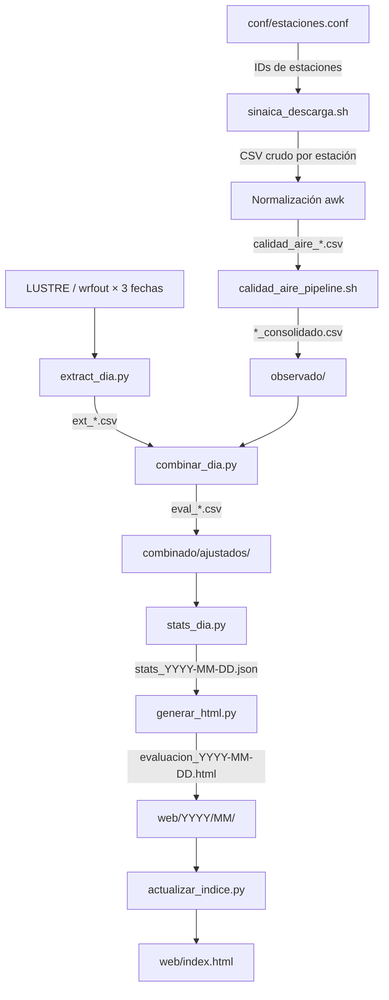

# 🌫️ ddsinaica — Pipeline de Evaluación WRF-Chem vs SINAICA

[](#requisitos-del-sistema)
[](#dependencias)
[](#licencia)
[](#changelog)

Pipeline operativo de descarga, procesamiento y validación estadística del pronóstico de calidad del aire producido por **WRF-Chem**, comparado contra observaciones horarias de la red **SINAICA/INECC**. Cubre **ocho zonas metropolitanas** del centro de México, evalúa **cuatro contaminantes** y está diseñado para ejecutarse de forma autónoma mediante crontab, publicando resultados en una página web estática actualizada cada día.

---

## Tabla de contenidos

- [Descripción](#descripción)
- [Arquitectura del flujo](#arquitectura-del-flujo)
- [Requisitos del sistema](#requisitos-del-sistema)
- [Dependencias](#dependencias)
- [Instalación](#instalación)
- [Configuración](#configuración)
- [Uso](#uso)
- [Estructura del repositorio](#estructura-del-repositorio)
- [Flujo de datos](#flujo-de-datos)
- [Ciudades y contaminantes](#ciudades-y-contaminantes)
- [Métricas de validación](#métricas-de-validación)
- [Manejo de errores](#manejo-de-errores)
- [Changelog](#changelog)
- [Contribución](#contribución)
- [Licencia](#licencia)

---

## Descripción

El repositorio implementa dos modos de operación:

| Modo | Script principal | Propósito |
|------|-----------------|-----------|
| **Operativo diario** | `evaluacion_diaria.sh` | Ejecutado por crontab; descarga, procesa y publica el análisis del día anterior en HTML. |
| **Histórico mensual** | `01_extrae.py` | Procesamiento manual de un mes completo; genera reportes Word con Bootstrap. |

A partir de la **v2.0.0** la descarga de observaciones se realiza íntegramente con `sinaica_descarga.sh` mediante HTTP directo al endpoint de SINAICA, eliminando la dependencia de R y el paquete `rsinaica`. Las versiones siguientes incorporaron correcciones de robustez, nuevas ciudades y el cuarto contaminante SO₂.

---

## Arquitectura del flujo

```
╔══════════════════════════════════════════════════════════════════╗
║  OBSERVACIONES (SINAICA/INECC)                                   ║
║                                                                  ║
║  sinaica_descarga.sh                                             ║
║  POST https://sinaica.inecc.gob.mx/pags/datGrafs.php             ║
║  ┌─ por estación × contaminante × día ─┐                         ║
║  │  tmp/raw_sinaica/<fecha>/*.csv      │                         ║
║  └───────────────┬─────────────────────┘                         ║
║                  ▼                                               ║
║  [Normalización awk al formato del pipeline]                     ║
║                  ▼                                               ║
║  calidad_aire_pipeline.sh                                        ║
║  ├─ salida/<Ciudad>_<Estacion>_<Cont>.csv                        ║
║  └─ consolidado/<Ciudad>_<Cont>_consolidado.csv                  ║
║                  │                                               ║
║                  └───────────► observado/  ◄───────────────────┐ ║
╚══════════════════════════════════════════════════════════════╗ │ ║
                                                               ║ │ ║
╔══════════════════════════════════════════════════════════════╝ │ ║
║  MODELO (WRF-Chem / LUSTRE)                                    │ ║
║                                                                │ ║
║  wrfout_d01_YYYY-MM-DD_00:00:00 × 3 horizontes                 │ ║
║              │                                                 │ ║
╚══════════════╪═════════════════════════════════════════════════╪═╝
               │                                                 │
               ▼                                                 │
  extract_dia.py  ───────────────────────────────────────────────┘
  O3/SO2: máx. espacial ppbv (ppmv × 1000)
  PM10/PM2.5: prom. de máx. espacial µg/m³
               │
               ▼
  combinar_dia.py
  (obs_max + mod_dia1/dia2/dia3 por ciudad × contaminante)
               │
               ▼
  stats_dia.py  →  stats_YYYY-MM-DD.json
  (BIAS, RMSE, MAE, R; POD, FAR, CSI, TSS, PC — ventana 30 días)
               │
       ┌───────┴──────────────┐
       ▼                      ▼
  generar_html.py        actualizar_indice.py
  web/YYYY/MM/           web/index.html
  evaluacion_YYYY-MM-DD.html
```

### Horizontes de pronóstico evaluados

Dado que cada run de WRF-Chem produce 72 h de pronóstico, el día de evaluación (`FECHA_EVAL = ayer`) está cubierto por tres runs distintos:

| Variable | Fecha del run | Horizonte | Índices wrfout | Ventana local |
|----------|--------------|-----------|----------------|---------------|
| `RUN_D1` | Ayer | +24 h (día 1) | 6–29 | 00:00–23:00 (24 h) |
| `RUN_D2` | Antier | +48 h (día 2) | 30–53 | 00:00–23:00 (24 h) |
| `RUN_D3` | Antes de ayer | +72 h (día 3) | 54–71 | 00:00–17:00 (18 h) |

El offset de 6 índices al inicio corresponde a UTC−6 (hora local del centro de México).

---

## Requisitos del sistema

| Componente | Versión mínima | Notas |
|------------|---------------|-------|
| bash | 4.0 | Arrays asociativos (`declare -A`) |
| curl | 7.x | Peticiones HTTP a SINAICA |
| python3 | 3.8 | Scripts de análisis y visualización |
| awk, sort, sed | POSIX | Procesamiento de CSV en bash |

> **macOS**: el bash instalado por defecto es la v3. Instalar `bash ≥ 4` con Homebrew:
> ```bash
> brew install bash
> ```
> Luego apuntar el crontab a `/usr/local/bin/bash`.

---

## Dependencias

### Python

```bash
pip install -r requirements.txt
```

**`requirements.txt`**:

```
xarray>=0.19
netCDF4>=1.5
pandas>=1.3
numpy>=1.21
matplotlib>=3.4
python-docx>=0.8
python-dateutil>=2.8
```

### Entorno reproducible (recomendado)

**Con venv**:

```bash
python3 -m venv .venv
source .venv/bin/activate
pip install -r requirements.txt
```

Configurar `PYTHON_BIN` en el entorno del crontab para apuntar al Python del venv:

```cron
PYTHON_BIN=/opt/wrf/evaluacion/.venv/bin/python3
0 7 * * * /opt/wrf/evaluacion/evaluacion_diaria.sh >> ...
```

**Con conda**:

```bash
conda create -n wrf-eval python=3.11
conda activate wrf-eval
pip install -r requirements.txt
```

### Sin R (desde v2.0.0)

A partir de la v2.0.0 **no se requiere R ni el paquete `rsinaica`**. La descarga se realiza directamente sobre el endpoint HTTP de SINAICA mediante `sinaica_descarga.sh`.

---

## Instalación

```bash
# 1. Clonar el repositorio
git clone https://github.com/JoseAgustin/ddsinaica.git
cd ddsinaica

# 2. Crear y activar entorno Python
python3 -m venv .venv
source .venv/bin/activate
pip install -r requirements.txt

# 3. Crear árbol de directorios de trabajo
#    (evaluacion_diaria.sh lo hace automáticamente en la primera
#     ejecución, pero se puede hacer manualmente para verificar permisos)
mkdir -p conf observado modelo combinado/ajustados logs tmp web/css

# 4. Dar permisos de ejecución a los scripts bash
chmod +x evaluacion_diaria.sh sinaica_descarga.sh calidad_aire_pipeline.sh

# 5. Editar las variables de configuración en la Sección 1 del script,
#    o exportarlas como variables de entorno:
export EVALUACION_DIR=/opt/wrf/evaluacion
export WRF_DIR=/LUSTRE/OPERATIVO/EXTERNO-salidas/WRF-CHEM
```

---

## Configuración

### Variables de entorno

| Variable | Descripción | Valor por defecto |
|----------|-------------|-------------------|
| `EVALUACION_DIR` | Ruta absoluta del proyecto | Directorio del script |
| `WRF_DIR` | Raíz de los wrfout de WRF-Chem | `/LUSTRE/OPERATIVO/EXTERNO-salidas/WRF-CHEM` |
| `PYTHON_BIN` | Ejecutable Python | `python3` |
| `SINAICA_TIPO` | Tipo de datos SINAICA | `""` = Crude (sin validar); `"V"` = Validado; `"M"` = Manual |

### Catálogo de estaciones (`conf/estaciones.conf`)

Archivo TSV con cinco columnas. El script genera una plantilla vacía en la primera ejecución; poblarla con los IDs reales de SINAICA antes de la primera descarga.

```
# ESTACION_ID  CIUDAD_WRF  CONT_SINAICA  NOMBRE_RED           NOMBRE_ESTACION
249            CDMX        O3            Valle de México       Merced
249            CDMX        PM10          Valle de México       Merced
501            Pachuca     O3            Pachuca               Primaria Ignacio Zaragoza
442            Tula        SO2           Tula                  Univ. Tecnológica Tula Tepeji
```

| Columna | Descripción |
|---------|-------------|
| `ESTACION_ID` | ID numérico de SINAICA (en la URL: `estacionId=XXX`) |
| `CIUDAD_WRF` | Nombre interno del modelo (debe coincidir con `CIUDADES_WRF`) |
| `CONT_SINAICA` | `O3`, `PM10`, `PM2.5` o `SO2` |
| `NOMBRE_RED` | Nombre de la red SINAICA (informativo) |
| `NOMBRE_ESTACION` | Nombre de la estación (informativo) |

Los IDs se obtienen en **https://sinaica.inecc.gob.mx** → Datos → buscar estación → el ID aparece en la URL (`estacionId=XXX`).

El catálogo actual incluye **119 registros** en 44 estaciones verificadas de 8 ciudades (ver detalle en [Ciudades y contaminantes](#ciudades-y-contaminantes)).

---

## Uso

### Modo automático (crontab)

```bash
# Evalúa el día anterior. Sin argumentos.
bash evaluacion_diaria.sh
```

**Instalación en crontab** (ejecutar a las 07:00 cada día):

```bash
crontab -e
```

```cron
# Variables de entorno para el pipeline
EVALUACION_DIR=/opt/wrf/evaluacion
WRF_DIR=/LUSTRE/OPERATIVO/EXTERNO-salidas/WRF-CHEM
PYTHON_BIN=/opt/wrf/evaluacion/.venv/bin/python3

# Evaluación diaria con log rotativo por fecha
0 7 * * * /opt/wrf/evaluacion/evaluacion_diaria.sh \
          >> /opt/wrf/evaluacion/logs/cron_$(date +\%Y\%m\%d).log 2>&1
```

### Modo reproceso (fecha específica)

```bash
# Reprocesar una fecha histórica
bash evaluacion_diaria.sh 2026-02-15

# Reprocesar con Python del venv
PYTHON_BIN=/opt/wrf/evaluacion/.venv/bin/python3 \
  bash evaluacion_diaria.sh 2026-02-15
```

En modo reproceso, si los CSV de SINAICA del día ya existen y tienen suficientes registros, se reutilizan sin volver a descargar.

### Descarga individual con `sinaica_descarga.sh`

```bash
# O3 de la estación 249, un día, salida CSV
bash sinaica_descarga.sh -e 249 -p O3 -f 2026-02-24 -r 1dia -c

# SO2 validado de la estación 442, un mes completo
bash sinaica_descarga.sh -e 442 -p SO2 -f 2026-01-01 -r 1mes -t V -c -o so2_ene.csv

# PM10 dos semanas, JSON a stdout
bash sinaica_descarga.sh -e 271 -p PM10 -f 2026-02-10 -r 2semanas

# Ayuda completa
bash sinaica_descarga.sh -h
```

### Verificar una ejecución

```bash
# Resumen rápido del día
grep -E "\[OK\]|\[WARN\]|\[ERROR\]" logs/evaluacion_$(date -d yesterday +%Y-%m-%d).log

# Verificar que el HTML existe
test -f web/$(date -d yesterday +%Y)/$(date -d yesterday +%m)/evaluacion_$(date -d yesterday +%Y-%m-%d).html \
  && echo "HTML OK" || echo "HTML FALTANTE"

# Probar la cadena completa sin crontab
bash evaluacion_diaria.sh $(date -d yesterday +%Y-%m-%d)
```

---

## Estructura del repositorio

```
ddsinaica/
│
├── evaluacion_diaria.sh          # Orquestador diario (crontab)
├── sinaica_descarga.sh           # Descarga HTTP directa de SINAICA
├── calidad_aire_pipeline.sh      # Separación y consolidación de observaciones
├── 01_extrae.py                  # Pipeline histórico mensual (modo manual)
├── requirements.txt              # Dependencias Python
│
├── conf/
│   └── estaciones.conf           # Catálogo de estaciones SINAICA (119 registros, TSV)
│
├── observado/                    # CSVs consolidados por ciudad (input del análisis)
│   ├── CDMX_O3_consolidado.csv
│   ├── Tula_SO2_consolidado.csv
│   └── ...
│
├── modelo/                       # Series históricas del modelo WRF-Chem
│   ├── maximos_diarios_o3_CDMX.csv
│   └── ...
│
├── combinado/
│   ├── combinado_CDMX_O3.csv     # Obs + modelo sin ajuste
│   └── ajustados/
│       └── eval_o3_CDMX_YYYY-MM-DD.csv
│
├── logs/
│   └── evaluacion_YYYY-MM-DD.log
│
├── tmp/                          # Scratch (se limpia al final de cada ejecución)
│   ├── raw_sinaica/
│   │   └── YYYY-MM-DD/
│   │       └── sinaica_<ID>_<Cont>_<Fecha>.csv
│   ├── pipeline_work/
│   │   ├── calidad_aire_<Ciudad>_<Estacion>.csv
│   │   ├── salida/
│   │   └── consolidado/
│   └── extraidos/
│       └── ext_<cont>_<ciudad>_h<n>.csv
│
└── web/                          # Sitio web estático
    ├── index.html                # Índice histórico de reportes
    ├── css/
    │   └── estilo.css
    └── YYYY/
        └── MM/
            └── evaluacion_YYYY-MM-DD.html
```

---

## Flujo de datos



---

## Ciudades y contaminantes

### Dominio WRF-Chem

| Ciudad (modelo) | Emoji | Red SINAICA | Lat S | Lat N | Lon O | Lon E | Estaciones |
|-----------------|:-----:|-------------|------:|------:|------:|------:|:----------:|
| CDMX | 🏙️ | Valle de México | 19.20 | 19.70 | −99.30 | −98.85 | 23 |
| Toluca | 🏔️ | Toluca | 19.23 | 19.39 | −99.72 | −99.50 | 5 |
| Puebla | ⛩️ | Puebla | 18.95 | 19.12 | −98.32 | −98.10 | 5 |
| Tlaxcala | 🌾 | Tlaxcala | 19.29 | 19.36 | −98.26 | −98.15 | 1 |
| Pachuca | ⛏️ | Pachuca / Mineral de la Reforma | 20.03 | 20.13 | −98.80 | −98.67 | 3 |
| Cuernavaca | 🌺 | Cuernavaca | 18.89 | 18.98 | −99.26 | −99.14 | 1 |
| SJdelRio | 🌊 | San Juan del Río | 20.36 | 20.41 | −100.01 | −99.93 | 1 |
| Tula | 🏭 | Tula / Tepeji / Atitalaquia / Atotonilco | 19.89 | 20.18 | −99.44 | −99.09 | 5 |

### Contaminantes y umbrales normativos

| Contaminante | Clave modelo | Unidades | Unidades observado | Factor conv. obs | Umbral | Norma |
|-------------|:------------:|:--------:|:-----------------:|:----------------:|-------:|-------|
| Ozono | `o3` | ppbv | ppmv | × 1 000 | 135 ppbv | NOM-020-SSA1 |
| PM10 | `PM10` | µg/m³ | µg/m³ | × 1 | 75 µg/m³ | NOM-025-SSA1-2021 |
| PM2.5 | `PM25` | µg/m³ | µg/m³ | × 1 | 45 µg/m³ | NOM-025-SSA1-2021 |
| Dióxido de azufre | `SO2` | ppbv | ppmv | × 1 000 | 130 ppbv | NOM-022-SSA1-2010 |

**Extracción desde wrfout:**

O₃ y SO₂ se extraen de `bottom_top=0` (capa superficial) y se convierten de ppmv a ppbv multiplicando × 1 000. El valor reportado es el **máximo espacial del máximo temporal** en la ventana del horizonte. PM10 y PM2.5 se calculan como el **promedio temporal del máximo espacial**. El script busca las siguientes variables en el netCDF:

| Contaminante | Nombres buscados en wrfout |
|-------------|---------------------------|
| SO₂ | `so2` (CB05), `SO2` (SAPRC99), `so2_a` (CB05+aerosol) |
| PM10 | `PM10`, `pm10` |
| PM2.5 | `PM2_5_DRY`, `PM2_5`, `pm2_5_dry`, `pm2_5` |

Si ningún nombre está presente en el archivo, el valor se registra como `NaN` con advertencia `[EXTRACT]` en el log.

### Disponibilidad de contaminantes por ciudad

| Ciudad | O₃ | PM10 | PM2.5 | SO₂ |
|--------|:--:|:----:|:-----:|:---:|
| CDMX | ✓ | ✓ | ✓ | — |
| Toluca | ✓ | ✓ | ✓ | — |
| Puebla | ✓ | ✓ | ✓ | — |
| Tlaxcala | ✓ | ✓ | ✓ | — |
| Pachuca | ✓ | ✓ | ✓ | — |
| Cuernavaca | ✓ | ✓ | ✓ | — |
| SJdelRio | ✓ | — | ✓ | — |
| Tula | ✓ | ✓ | ✓ | ✓ |

SO₂ se monitorea activamente en Tula por ser la zona con mayor concentración de fuentes primarias del dominio: la refinería Miguel Hidalgo (Pemex) y la central termoeléctrica Francisco Pérez Ríos (CFE). Para las demás ciudades, SINAICA devuelve array vacío y el registro se omite sin generar error en el pipeline.

---

## Métricas de validación

Calculadas sobre una ventana deslizante de **30 días** para los tres horizontes de pronóstico.

### Continuas

| Métrica | Fórmula | Descripción |
|---------|---------|-------------|
| BIAS | mean(mod − obs) | Sesgo sistemático |
| RMSE | √mean((mod − obs)²) | Error cuadrático medio |
| MAE | mean(\|mod − obs\|) | Error absoluto medio |
| R | Pearson | Coeficiente de correlación |

### Dicotómicas (tabla de contingencia 2×2)

Cada día se clasifica como evento (valor ≥ umbral normativo) o no-evento.

| Métrica | Fórmula | Descripción |
|---------|---------|-------------|
| POD | H / (H + M) | Probabilidad de detección |
| FAR | F / (H + F) | Tasa de falsas alarmas |
| CSI | H / (H + M + F) | Índice de éxito crítico |
| TSS | POD − POFD | Pierce Skill Score |
| PC | (H + C) / N | Porcentaje correcto |

H = acierto, M = fallo, F = falsa alarma, C = rechazo correcto, N = total.

### Semáforo visual en la página HTML

| Color | Criterio BIAS | Criterio R |
|-------|:------------:|:----------:|
| 🟢 Verde | \|BIAS\| < 10 | R ≥ 0.7 |
| 🟡 Ámbar | 10 ≤ \|BIAS\| < 25 | 0.4 ≤ R < 0.7 |
| 🔴 Rojo | \|BIAS\| ≥ 25 | R < 0.4 |

La página HTML generada presenta los resultados en pestañas por contaminante (O₃ · PM10 · PM2.5 · SO₂) y por horizonte de pronóstico (+24 h · +48 h · +72 h), con gráficas de serie de tiempo y tablas de métricas continuas y dicotómicas.

---

## Manejo de errores

### Comportamiento ante fallos parciales

El pipeline está diseñado para ser **tolerante a fallos parciales**: si un componente no está disponible, el proceso continúa con los datos existentes y registra la advertencia en el log.

| Situación | Comportamiento |
|-----------|---------------|
| 0 de 3 wrfout disponibles | **Aborta** con código 1 (fallo crítico) |
| 1 ó 2 de 3 wrfout disponibles | Continúa; rellena con `NA` los horizontes faltantes |
| Descarga SINAICA fallida tras 3 reintentos | Advertencia en log; continúa con observaciones previas en `observado/` |
| CSV con menos de 18 registros horarios | Se descarta y se registra como inválido |
| Variable del contaminante ausente en wrfout | `NaN` con advertencia `[EXTRACT]`; otros contaminantes continúan |
| API SINAICA retorna > 24 registros para `rango=1dia` | Recorte automático al día máximo con aviso `[TRIM]` en stderr |
| Error en extracción Python | Advertencia en log; los demás horizontes continúan |
| Error en generación HTML | Advertencia; el índice histórico se actualiza igualmente |

### Interpretación del log

```
2026-03-15 07:01:42 [INFO]   ↓ est=249 | Merced | O3 | Valle de México
2026-03-15 07:01:44 [OK]     ✓ sinaica_249_O3_2026-03-14.csv — 24 registros
2026-03-15 07:01:51 [INFO]   ↓ est=442 | Univ. Tec. Tula | SO2 | Tula
2026-03-15 07:01:53 [OK]     ✓ sinaica_442_SO2_2026-03-14.csv — 24 registros
2026-03-15 07:02:11 [WARN]   ✗ 2026-03-12 → NO encontrado: /LUSTRE/.../wrfout_...
2026-03-15 07:04:33 [OK]     ✓ Extracción horizonte 1 OK.
```

### Verificar la salida del crontab

```bash
# Resumen rápido del día
grep -E "\[OK\]|\[WARN\]|\[ERROR\]" logs/evaluacion_$(date -d yesterday +%Y-%m-%d).log

# Ver log completo del día anterior
tail -100 logs/evaluacion_$(date -d yesterday +%Y-%m-%d).log

# Verificar que el HTML existe
test -f web/$(date -d yesterday +%Y)/$(date -d yesterday +%m)/evaluacion_$(date -d yesterday +%Y-%m-%d).html \
  && echo "HTML OK" || echo "HTML FALTANTE"
```

---

## Changelog

| Versión | Cambios principales |
|---------|-------------------|
| **v2.4.0** | SO₂ como cuarto contaminante: `UMBRAL[SO2]=130 ppbv` (NOM-022-SSA1-2010); `VARS_GAS` en `extract_dia.py`; conversión ppmv→ppbv; 5 estaciones SO₂ en Tula; cuarta pestaña en la página HTML; `calidad_aire_pipeline.sh` actualizado. |
| **v2.3.0** | Nueva ciudad **Tula de Allende** con bbox y 5 estaciones verificadas (IDs 442, 87, 502, 82, 83). Nueva estación **Mineral de la Reforma** (ID=495) en Pachuca. Catálogo completo: 119 registros en 44 estaciones. |
| **v2.2.0** | Corrección `CIUDAD_OBS_MAP[CDMX]`: `"Valle_de_Mexico"` → `"CDMX"`. Catálogo completo de 96 estaciones sin IDs de marcador (999). |
| **v2.1.0** | Tres correcciones en `combinar_dia.py`: detección automática del formato de fecha del consolidado (YYYYMMDD vs YYYY-MM-DD), conversión ppmv→ppbv del O₃ observado, y comparación de fechas robusta con `pd.Timestamp`. Filtro `[TRIM]` en `sinaica_descarga.sh` para respuestas con > 24 registros. Sección descriptiva en el HTML. |
| **v2.0.0** | Eliminación de R y `rsinaica`; descarga directa con `sinaica_descarga.sh` vía HTTP POST a SINAICA. |
| **v1.0.0** | Versión inicial con 7 ciudades y descarga vía R/rsinaica. |

El historial detallado está en [RELEASE_NOTES.md](RELEASE_NOTES.md).

---

## Contribución

Las contribuciones son bienvenidas. Por favor seguir el siguiente flujo:

1. Hacer fork del repositorio.
2. Crear una rama descriptiva: `git checkout -b feat/nombre-de-la-mejora`.
3. Hacer los cambios con commits atómicos y mensajes claros en español o inglés.
4. Verificar que `bash -n evaluacion_diaria.sh` no reporta errores de sintaxis.
5. Probar localmente con `bash evaluacion_diaria.sh <fecha-histórica>`.
6. Abrir un Pull Request describiendo el cambio y su motivación.

### Reporte de errores

Abrir un Issue en GitHub incluyendo:
- La fecha de ejecución que falló
- Las últimas 50 líneas del log correspondiente (`tail -50 logs/evaluacion_<fecha>.log`)
- Salida de `bash --version` y `python3 --version`

---

## Licencia

MIT License — ver archivo [LICENSE](LICENSE).

```
Copyright (c) 2026  Pipeline WRF-Chem / Red de Calidad del Aire — Centro de México
```
