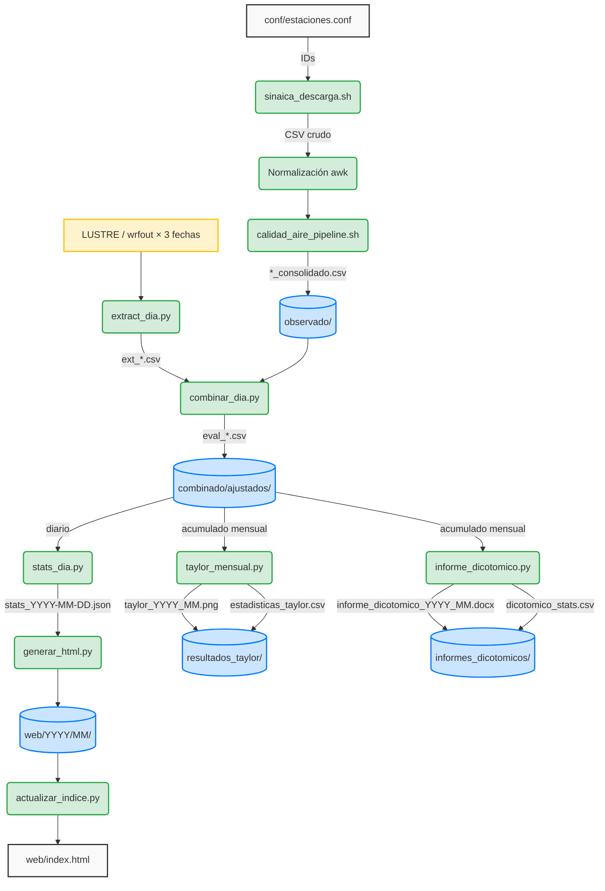

# 🌫️ ddsinaica — Pipeline de Evaluación WRF-Chem vs SINAICA

[](#requisitos-del-sistema)
[](#dependencias)
[](#licencia)
[](#changelog)

Pipeline operativo de descarga, procesamiento y validación estadística del pronóstico de calidad del aire producido por **WRF-Chem**, comparado contra observaciones horarias de la red **SINAICA/INECC**. Cubre **ocho zonas metropolitanas** del centro de México, evalúa **cuatro contaminantes** y está diseñado para ejecutarse de forma autónoma mediante crontab, publicando resultados en una página web estática actualizada cada día. Incluye módulos de **análisis mensual con diagramas de Taylor** e **informes de estadísticos dicotómicos** en formato Word.

---

## Tabla de contenidos

- [Descripción](#descripción)
- [Arquitectura del flujo](#arquitectura-del-flujo)
- [Requisitos del sistema](#requisitos-del-sistema)
- [Dependencias](#dependencias)
- [Instalación](#instalación)
- [Configuración](#configuración)
- [Uso](#uso)
- [Diagramas de Taylor mensuales](#diagramas-de-taylor-mensuales)
- [Informe de estadísticos dicotómicos](#informe-de-estadísticos-dicotómicos)
- [Estructura del repositorio](#estructura-del-repositorio)
- [Flujo de datos](#flujo-de-datos)
- [Ciudades y contaminantes](#ciudades-y-contaminantes)
- [Métricas de validación](#métricas-de-validación)
- [Manejo de errores](#manejo-de-errores)
- [Changelog](#changelog)
- [Contribución](#contribución)
- [Licencia](#licencia)

---

## Descripción

El repositorio implementa cuatro modos de operación:

| Modo                        | Script principal          | Propósito |
|------------------------------|---------------------------|-----------|
| **Operativo diario**        | `evaluacion_diaria.sh`    | Ejecutado por crontab; descarga, procesa y publica el análisis del día anterior en HTML. |
| **Histórico mensual**       | `01_extrae.py`            | Procesamiento manual de un mes completo; genera reportes Word con Bootstrap. |
| **Diagnóstico continuo**    | `taylor_mensual.py`       | Diagramas de Taylor mensuales (σ, R, CRMSE normalizados) por Ciudad × Contaminante × Horizonte. |
| **Diagnóstico dicotómico**  | `informe_dicotomico.py`   | Informe Word mensual de POD, FAR, CSI, TSS, PC y BIAS de frecuencia, evaluando la detección de episodios de excedencia normativa. |

A partir de la **v2.0.0** la descarga de observaciones se realiza con `sinaica_descarga.sh` mediante HTTP directo al endpoint de SINAICA, eliminando la dependencia de R y `rsinaica`. Las versiones posteriores incorporaron SO₂, nuevas ciudades, correcciones de robustez y, en las **v2.5.0** y **v2.6.0**, los módulos de análisis estadístico mensual.

---

## Arquitectura del flujo

```
╔══════════════════════════════════════════════════════════════════╗
║  OBSERVACIONES (SINAICA/INECC)                                   ║
║                                                                  ║
║  sinaica_descarga.sh                                             ║
║  POST https://sinaica.inecc.gob.mx/pags/datGrafs.php             ║
║  ┌─ por estación × contaminante × día ─┐                         ║
║  │  tmp/raw_sinaica/<fecha>/*.csv      │                         ║
║  └───────────────┬─────────────────────┘                         ║
║                  ▼                                               ║
║  [Normalización awk al formato del pipeline]                     ║
║                  ▼                                               ║
║  calidad_aire_pipeline.sh                                        ║
║  ├─ salida/<Ciudad>_<Estacion>_<Cont>.csv                        ║
║  └─ consolidado/<Ciudad>_<Cont>_consolidado.csv                  ║
║                  │                                               ║
║                  └───────────► observado/ ◄────────────────────┐ ║
╚══════════════════════════════════════════════════════════╗     │ ║
                                                           ║     │ ║
╔══════════════════════════════════════════════════════════╝     │ ║
║  MODELO (WRF-Chem / LUSTRE)                                    │ ║
║                                                                │ ║
║  wrfout_d01_YYYY-MM-DD_00:00:00 × 3 horizontes                 │ ║
╚══════════════╤═════════════════════════════════════════════════╪═╝
               │                                                 │
               ▼                                                 │
  extract_dia.py ─────────────────────────────────────────────── ┘
  O3/SO2: máx. espacial ppbv (ppmv × 1000)
  PM10/PM2.5: prom. de máx. espacial µg/m³
               │
               ▼
  combinar_dia.py
  obs_max + mod_dia1/dia2/dia3  por  ciudad × contaminante
               │
               ▼
  stats_dia.py → stats_YYYY-MM-DD.json
  (BIAS, RMSE, MAE, R; POD, FAR, CSI, TSS, PC — ventana 30 días)
               │
       ┌───────┴──────────────┐
       ▼                      ▼
  generar_html.py        actualizar_indice.py
  web/YYYY/MM/           web/index.html
  evaluacion_YYYY-MM-DD.html
               │
       ┌───────┴────────────────────────┐
       ▼  (acumulado mensual)           ▼  (acumulado mensual)
  taylor_mensual.py            informe_dicotomico.py
  taylor_YYYY_MM.png           informe_dicotomico_YYYY_MM.docx
  estadisticas_taylor.csv      dicotomico_stats.csv
```

### Horizontes de pronóstico evaluados

| Variable | Fecha del run | Horizonte     | Índices wrfout | Ventana local      |
|----------|---------------|---------------|----------------|--------------------|
| `RUN_D1` | Ayer          | +24 h (día 1) | 6–29           | 00:00–23:00 (24 h) |
| `RUN_D2` | Antier        | +48 h (día 2) | 30–53          | 00:00–23:00 (24 h) |
| `RUN_D3` | Antes de ayer | +72 h (día 3) | 54–71          | 00:00–17:00 (18 h) |

El offset de 6 índices corresponde a UTC−6 (hora local del centro de México).

---

## Requisitos del sistema

| Componente     | Versión mínima | Notas |
|----------------|----------------|-------|
| bash           | 4.0            | Arrays asociativos (`declare -A`) |
| curl           | 7.x            | Peticiones HTTP a SINAICA |
| python3        | 3.8            | Scripts de análisis y generación de documentos |
| awk, sort, sed | POSIX          | Procesamiento de CSV en bash |
| npm            | 12.0.1         | Ambiente Node.js |
| docx           | 9.7.1          | Generación de documento docx |

> **macOS**: el bash instalado por defecto es la v3. Instalar `bash ≥ 4` con Homebrew (`brew install bash`) y apuntar el crontab a `/usr/local/bin/bash`.

---

## Dependencias

### Python

```bash
pip install -r requirements.txt
```

**`requirements.txt`**:

```
xarray>=0.19
netCDF4>=1.5
pandas>=1.3
numpy>=1.21
matplotlib>=3.4
scipy>=1.7
python-docx>=0.8
python-dateutil>=2.8
```

| Paquete       | Introducido en | Uso |
|---------------|----------------|-----|
| `xarray`      | v1.0.0         | Lectura de wrfout NetCDF |
| `netCDF4`     | v1.0.0         | Backend NetCDF |
| `pandas`      | v1.0.0         | Manipulación de series temporales |
| `numpy`       | v1.0.0         | Cálculo numérico |
| `matplotlib`  | v2.5.0         | Diagramas de Taylor (PNG) |
| `scipy`       | v2.5.0         | Correlación de Pearson en `taylor_mensual.py` |
| `python-docx` | v2.6.0         | Generación de informes `.docx` en `informe_dicotomico.py` |
| `python-dateutil` | v1.0.0     | Parseo robusto de fechas |

### Sin R (desde v2.0.0)

A partir de la v2.0.0 **no se requiere R ni `rsinaica`**. La descarga se realiza directamente sobre el endpoint HTTP de SINAICA mediante `sinaica_descarga.sh`.

### Entorno reproducible (recomendado)

```bash
# Con venv
python3 -m venv .venv
source .venv/bin/activate
pip install -r requirements.txt

# Con conda
conda create -n wrf-eval python=3.11
conda activate wrf-eval
pip install -r requirements.txt
```

---

## Instalación

```bash
# 1. Clonar el repositorio
git clone https://github.com/JoseAgustin/ddsinaica.git
cd ddsinaica

# 2. Crear y activar entorno Python
python3 -m venv .venv
source .venv/bin/activate
pip install -r requirements.txt

# 3. Crear árbol de directorios de trabajo
mkdir -p conf observado modelo combinado/ajustados \
         logs tmp web/css resultados_taylor informes_dicotomicos

# 4. Dar permisos de ejecución a los scripts bash
chmod +x evaluacion_diaria.sh sinaica_descarga.sh calidad_aire_pipeline.sh

# 5. Exportar variables de entorno
export EVALUACION_DIR=/opt/wrf/evaluacion
export WRF_DIR=/LUSTRE/OPERATIVO/EXTERNO-salidas/WRF-CHEM
```

---

## Configuración

### Variables de entorno

| Variable          | Descripción                      | Valor por defecto |
|-------------------|----------------------------------|-------------------|
| `EVALUACION_DIR`  | Ruta absoluta del proyecto       | Directorio del script |
| `WRF_DIR`         | Raíz de los wrfout de WRF-Chem   | `/LUSTRE/OPERATIVO/EXTERNO-salidas/WRF-CHEM` |
| `PYTHON_BIN`      | Ejecutable Python                | `python3` |
| `SINAICA_TIPO`    | Tipo de datos SINAICA            | `""` Crude; `"V"` Validado; `"M"` Manual |

### Catálogo de estaciones (`conf/estaciones.conf`)

Archivo TSV con cinco columnas. El catálogo actual incluye **119 registros** en 44 estaciones verificadas de 8 ciudades.

```
# ESTACION_ID  CIUDAD_WRF  CONT_SINAICA  NOMBRE_RED          NOMBRE_ESTACION
249            CDMX        O3            Valle de México      Merced
249            CDMX        PM10          Valle de México      Merced
501            Pachuca     O3            Pachuca              Primaria Ignacio Zaragoza
442            Tula        SO2           Tula                 Univ. Tecnológica Tula Tepeji
```

Los IDs se obtienen en <https://sinaica.inecc.gob.mx> → Datos → buscar estación → `estacionId=XXX` en la URL.

---

## Uso

### Modo automático (crontab)

```bash
# Evalúa el día anterior (sin argumentos)
bash evaluacion_diaria.sh
```

**Crontab completo** (evaluación diaria + análisis mensual automatizados):

```cron
EVALUACION_DIR=/opt/wrf/evaluacion
WRF_DIR=/LUSTRE/OPERATIVO/EXTERNO-salidas/WRF-CHEM
PYTHON_BIN=/opt/wrf/evaluacion/.venv/bin/python3

# Evaluación diaria — 07:00
0 7 * * * $EVALUACION_DIR/evaluacion_diaria.sh \
    >> $EVALUACION_DIR/logs/cron_$(date +\%Y\%m\%d).log 2>&1

# Diagrama de Taylor del mes anterior — día 1 de cada mes, 08:00
0 8 1 * * $PYTHON_BIN $EVALUACION_DIR/taylor_mensual.py \
    --entrada $EVALUACION_DIR/combinado/ajustados \
    --salida  $EVALUACION_DIR/resultados_taylor \
    --mes $(date -d "last month" +\%Y-\%m) \
    >> $EVALUACION_DIR/logs/taylor_$(date +\%Y\%m).log 2>&1

# Informe dicotómico del mes anterior — día 1 de cada mes, 08:30
30 8 1 * * $PYTHON_BIN $EVALUACION_DIR/informe_dicotomico.py \
    --entrada $EVALUACION_DIR/combinado/ajustados \
    --salida  $EVALUACION_DIR/informes_dicotomicos/informe_$(date -d "last month" +\%Y_\%m).docx \
    --mes $(date -d "last month" +\%Y-\%m) \
    --csv-auditoria $EVALUACION_DIR/informes_dicotomicos/stats_$(date -d "last month" +\%Y_\%m).csv \
    >> $EVALUACION_DIR/logs/dicotomico_$(date +\%Y\%m).log 2>&1
```

### Modo reproceso (fecha específica)

```bash
bash evaluacion_diaria.sh 2026-02-15
```

### Descarga individual con `sinaica_descarga.sh`

```bash
# O3 de la estación 249, un día, salida CSV
bash sinaica_descarga.sh -e 249 -p O3 -f 2026-02-24 -r 1dia -c

# SO2 validado de la estación 442, un mes completo
bash sinaica_descarga.sh -e 442 -p SO2 -f 2026-01-01 -r 1mes -t V -c -o so2_ene.csv

# Ayuda completa
bash sinaica_descarga.sh -h
```

---

## Diagramas de Taylor mensuales

[`taylor_mensual.py`](taylor_mensual.py) consolida los CSV diarios de `combinado/ajustados/` y genera, para cada mes, un diagrama de Taylor y un CSV de estadísticos. Cada punto representa una combinación **Ciudad × Contaminante × Horizonte** (p. ej. *"Pachuca PM10 24h"*, *"Tula SO₂ 48h"*).

### Entrada

```
combinado/ajustados/eval_<CONT>_<Ciudad>_YYYY-MM-DD.csv
Fecha,Ciudad,max_obs,mod_dia1,mod_dia2,mod_dia3
```

### Salidas por mes

| Archivo                         | Contenido |
|---------------------------------|-----------|
| `taylor_YYYY_MM.png`            | Diagrama de Taylor normalizado por σ_obs |
| `estadisticas_taylor.csv`       | n, σ_obs, σ_mod, R, BIAS, RMSE, MAE, CRMSE, CRMSE_n, p-valor |

Cuando se usa `--ciudades`, los archivos llevan un sufijo (p. ej. `taylor_2026_06_Pachuca-Tula.png`).

### Metodología

- **Eje radial**: σ_mod / σ_obs (desviación estándar normalizada)
- **Ángulo θ**: arccos(R), R = correlación de Pearson
- **CRMSE_n**: √(r² + 1 − 2·r·R), distancia al punto de referencia
- **Punto REF**: (1, 0) — modelo perfecto

### Uso

```bash
# Todos los meses, todas las ciudades
python3 taylor_mensual.py --entrada combinado/ajustados --salida resultados_taylor

# Un mes específico
python3 taylor_mensual.py --mes 2026-06

# Filtrar ciudades (por espacio o coma)
python3 taylor_mensual.py --ciudades Pachuca Tula CDMX
python3 taylor_mensual.py --ciudades "Pachuca,Tula,CDMX"
```

### Parámetros

| Parámetro         | Descripción                                            | Default               |
|-------------------|--------------------------------------------------------|-----------------------|
| `--entrada, -i`   | Directorio con CSV `eval_*.csv`                        | `combinado/ajustados` |
| `--salida, -o`    | Directorio de salida (PNG y CSV)                       | `.`                   |
| `--mes, -m`       | Procesar solo este mes (`YYYY-MM`)                     | todos                 |
| `--ciudades, -c`  | Una o varias ciudades del catálogo                     | todas                 |
| `--min-pares, -p` | Mínimo de pares obs/mod válidos por serie              | `5`                   |
| `--max-radio, -r` | Radio máximo del diagrama (unidades normalizadas)      | `1.65`                |
| `--dpi`           | Resolución de los PNG                                  | `150`                 |

---

## Informe de estadísticos dicotómicos

[`informe_dicotomico.py`](informe_dicotomico.py) genera un documento Word (`.docx`) con los estadísticos de verificación dicotómica mensuales para los cuatro contaminantes regulados, organizados por ciudad y horizonte de pronóstico. Requiere únicamente `python-docx` — **sin dependencia de Node.js ni de ningún otro runtime externo**.

### Fundamento: tabla de contingencia 2×2

Cada día se clasifica como EVENTO (valor ≥ umbral normativo) o NO EVENTO:

|                  | Obs. EVENTO | Obs. NO EVENTO |
|------------------|-------------|----------------|
| **Mod. EVENTO**  | H — Acierto | F — Falsa alarma |
| **Mod. NO EVENTO** | M — Fallo | C — Rechazo correcto |

### Métricas calculadas

| Métrica  | Fórmula               | Ideal | Descripción |
|----------|-----------------------|-------|-------------|
| **POD**  | H / (H + M)           | → 1   | Probabilidad de detección |
| **FAR**  | F / (H + F)           | → 0   | Tasa de falsas alarmas |
| **CSI**  | H / (H + M + F)       | → 1   | Índice de éxito crítico |
| **TSS**  | H/(H+M) − F/(F+C)    | → 1   | Pierce Skill Score |
| **PC**   | (H + C) / N           | → 1   | Porcentaje correcto |
| **BIAS** | (H + F) / (H + M)    | = 1   | Sesgo de frecuencia |

### Umbrales normativos

| Contaminante | Umbral     | Unidad  | Norma             |
|--------------|------------|---------|-------------------|
| O₃           | 135        | ppbv    | NOM-020-SSA1      |
| PM10         | 75         | µg/m³   | NOM-025-SSA1-2021 |
| PM2.5        | 45         | µg/m³   | NOM-025-SSA1-2021 |
| SO₂          | 130        | ppbv    | NOM-022-SSA1-2010 |

### Contenido del documento Word

El documento se genera en orientación horizontal (A4 landscape) e incluye:

1. **Portada** — título, meses evaluados y filiación institucional
2. **Metodología** — tabla de umbrales, tabla de contingencia conceptual (coloreada), definición de cada métrica con fórmula, leyenda de semáforo de desempeño
3. **Resultados por mes → por contaminante**:
   - Descripción del contaminante y base normativa
   - Tabla de estadísticos (POD, FAR, CSI, TSS, PC, BIAS) × 3 horizontes, con semáforo de colores (🟢 verde / 🟡 ámbar / 🔴 rojo) por celda
   - Tabla de contingencia con valores crudos H, M, F, C
4. **Notas técnicas**

### Uso

```bash
# Todos los meses, todas las ciudades
python3 informe_dicotomico.py --entrada combinado/ajustados --salida informe.docx

# Un mes específico
python3 informe_dicotomico.py --mes 2026-06 --salida informe_jun2026.docx

# Filtrar ciudades + exportar CSV de auditoría
python3 informe_dicotomico.py \
    --ciudades Pachuca Tula CDMX \
    --csv-auditoria stats_dicotomicos.csv

# Ayuda
python3 informe_dicotomico.py --help
```

### Parámetros

| Parámetro            | Descripción                                              | Default               |
|----------------------|----------------------------------------------------------|-----------------------|
| `--entrada, -i`      | Directorio con CSV `eval_*.csv`                          | `combinado/ajustados` |
| `--salida, -o`       | Ruta del `.docx` de salida                               | `informe_dicotomico.docx` |
| `--mes, -m`          | Procesar solo este mes (`YYYY-MM`)                       | todos                 |
| `--ciudades, -c`     | Una o varias ciudades del catálogo                       | todas                 |
| `--csv-auditoria`    | Ruta opcional para exportar CSV con todos los estadísticos | —                   |

---

## Estructura del repositorio

```
ddsinaica/
│
├── evaluacion_diaria.sh          # Orquestador diario (crontab)
├── sinaica_descarga.sh           # Descarga HTTP directa de SINAICA
├── calidad_aire_pipeline.sh      # Separación y consolidación de observaciones
├── 01_extrae.py                  # Pipeline histórico mensual (modo manual)
├── taylor_mensual.py             # Diagramas de Taylor mensuales
├── informe_dicotomico.py         # Informe Word de estadísticos dicotómicos
├── requirements.txt              # Dependencias Python
├── RELEASE_NOTES.md              # Historial detallado de versiones
│
├── conf/
│   └── estaciones.conf           # Catálogo de estaciones SINAICA (119 registros, TSV)
│
├── observado/                    # CSVs consolidados por ciudad
│   ├── CDMX_O3_consolidado.csv
│   └── ...
│
├── modelo/                       # Series históricas del modelo WRF-Chem
│   └── maximos_diarios_o3_CDMX.csv
│
├── combinado/
│   ├── combinado_CDMX_O3.csv
│   └── ajustados/
│       └── eval_<CONT>_<Ciudad>_YYYY-MM-DD.csv
│
├── resultados_taylor/            # Salidas de taylor_mensual.py
│   ├── taylor_YYYY_MM.png
│   └── estadisticas_taylor.csv
│
├── informes_dicotomicos/         # Salidas de informe_dicotomico.py
│   ├── informe_dicotomico_YYYY_MM.docx
│   └── dicotomico_stats_YYYY_MM.csv
│
├── logs/
│   └── evaluacion_YYYY-MM-DD.log
│
├── tmp/                          # Scratch (limpiado al final de cada ejecución)
│   ├── raw_sinaica/YYYY-MM-DD/
│   ├── pipeline_work/
│   └── extraidos/
│
└── web/                          # Sitio web estático
    ├── index.html
    ├── css/estilo.css
    └── YYYY/MM/evaluacion_YYYY-MM-DD.html
```

---

## Flujo de datos


```mermaid
graph TD
    %% Estilos de los nodos
    classDef config fill:#f9f9f9,stroke:#333,stroke-width:2px;
    classDef script fill:#d4edda,stroke:#28a745,stroke-width:2px;
    classDef folder fill:#cce5ff,stroke:#007bff,stroke-width:2px;
    classDef model fill:#fff3cd,stroke:#ffc107,stroke-width:2px;

    %% Nodos principales (Ramas de origen)
    A[conf/estaciones.conf]:::config -->|IDs| B(sinaica_descarga.sh):::script
    B -->|CSV crudo| C(Normalización awk):::script
    C --> D(calidad_aire_pipeline.sh):::script
    D -->|*_consolidado.csv| E[(observado/)]:::folder

    F[LUSTRE / wrfout × 3 fechas]:::model --> G(extract_dia.py):::script
    G -->|ext_*.csv| H(combinar_dia.py):::script
    E --> H

    %% Combinación
    H -->|eval_*.csv| I[(combinado/ajustados/)]:::folder

    %% Derivaciones
    I -->|diario| J(stats_dia.py):::script
    I -->|acumulado mensual| O(taylor_mensual.py):::script
    I -->|acumulado mensual| Q(informe_dicotomico.py):::script

    %% Salidas de evaluación diaria
    J -->|stats_YYYY-MM-DD.json| K(generar_html.py):::script
    K --> L[(web/YYYY/MM/)]:::folder
    L --> M(actualizar_indice.py):::script
    M --> N[web/index.html]:::config

    %% Salidas de reportes mensuales
    O -->|taylor_YYYY_MM.png| P[(resultados_taylor/)]:::folder
    O -->|estadisticas_taylor.csv| P
    
    Q -->|informe_dicotomico_YYYY_MM.docx| R[(informes_dicotomicos/)]:::folder
    Q -->|dicotomico_stats.csv| R
```
---

## Ciudades y contaminantes

### Dominio WRF-Chem

| Ciudad (modelo) | Red SINAICA                              | Lat S | Lat N | Lon O    | Lon E   | Est. |
|-----------------|------------------------------------------|-------|-------|----------|---------|------|
| CDMX            | Valle de México                          | 19.20 | 19.70 | −99.30   | −98.85  | 23   |
| Toluca          | Toluca                                   | 19.23 | 19.39 | −99.72   | −99.50  | 5    |
| Puebla          | Puebla                                   | 18.95 | 19.12 | −98.32   | −98.10  | 5    |
| Tlaxcala        | Tlaxcala                                 | 19.29 | 19.36 | −98.26   | −98.15  | 1    |
| Pachuca         | Pachuca / Mineral de la Reforma          | 20.03 | 20.13 | −98.80   | −98.67  | 3    |
| Cuernavaca      | Cuernavaca                               | 18.89 | 18.98 | −99.26   | −99.14  | 1    |
| SJdelRio        | San Juan del Río                         | 20.36 | 20.41 | −100.01  | −99.93  | 1    |
| Tula            | Tula / Tepeji / Atitalaquia / Atotonilco | 19.89 | 20.18 | −99.44   | −99.09  | 5    |

### Contaminantes y umbrales

| Contaminante      | Clave   | Unidad  | Umbral    | Norma             |
|-------------------|---------|---------|-----------|-------------------|
| Ozono             | `O3`    | ppbv    | 135 ppbv  | NOM-020-SSA1      |
| PM10              | `PM10`  | µg/m³   | 75 µg/m³  | NOM-025-SSA1-2021 |
| PM2.5             | `PM25`  | µg/m³   | 45 µg/m³  | NOM-025-SSA1-2021 |
| Dióxido de azufre | `SO2`   | ppbv    | 130 ppbv  | NOM-022-SSA1-2010 |

### Disponibilidad por ciudad

| Ciudad     | O₃ | PM10 | PM2.5 | SO₂ |
|------------|:--:|:----:|:-----:|:---:|
| CDMX       | ✓  | ✓    | ✓     | —   |
| Toluca     | ✓  | ✓    | ✓     | —   |
| Puebla     | ✓  | ✓    | ✓     | —   |
| Tlaxcala   | ✓  | ✓    | ✓     | —   |
| Pachuca    | ✓  | ✓    | ✓     | —   |
| Cuernavaca | ✓  | ✓    | ✓     | —   |
| SJdelRio   | ✓  | —    | ✓     | —   |
| Tula       | ✓  | ✓    | ✓     | ✓   |

---

## Métricas de validación

### Continuas (stats_dia.py y taylor_mensual.py)

| Métrica | Fórmula                                          | Descripción |
|---------|--------------------------------------------------|-------------|
| BIAS    | mean(mod − obs)                                  | Sesgo sistemático |
| RMSE    | √mean((mod − obs)²)                              | Error cuadrático medio |
| MAE     | mean(\|mod − obs\|)                              | Error absoluto medio |
| R       | Pearson                                          | Coeficiente de correlación |
| CRMSE   | √(σ_mod² + σ_obs² − 2·σ_mod·σ_obs·R)           | RMSE centrado (Taylor 2001) |

### Dicotómicas (stats_dia.py e informe_dicotomico.py)

| Métrica  | Fórmula             | Ideal | Descripción |
|----------|---------------------|-------|-------------|
| POD      | H / (H + M)         | → 1   | Probabilidad de detección |
| FAR      | F / (H + F)         | → 0   | Tasa de falsas alarmas |
| CSI      | H / (H + M + F)     | → 1   | Índice de éxito crítico |
| TSS      | POD − F/(F+C)       | → 1   | Pierce Skill Score |
| PC       | (H + C) / N         | → 1   | Porcentaje correcto |
| BIAS     | (H + F) / (H + M)   | = 1   | Sesgo de frecuencia |

### Semáforo de desempeño (informe_dicotomico.py)

| Métrica | 🟢 Bueno      | 🟡 Aceptable   | 🔴 Deficiente |
|---------|---------------|----------------|---------------|
| POD     | ≥ 0.700       | 0.400 – 0.699  | < 0.400       |
| FAR     | ≤ 0.300       | 0.301 – 0.500  | > 0.500       |
| CSI     | ≥ 0.400       | 0.200 – 0.399  | < 0.200       |
| TSS     | ≥ 0.400       | 0.100 – 0.399  | < 0.100       |
| BIAS    | \|BIAS-1\|≤0.3| 0.3 – 0.6      | > 0.6         |

---

## Manejo de errores

| Situación | Comportamiento |
|-----------|----------------|
| 0 de 3 wrfout disponibles | **Aborta** con código 1 |
| 1 ó 2 de 3 wrfout disponibles | Continúa; rellena con `NA` los horizontes faltantes |
| Descarga SINAICA fallida (3 reintentos) | Advertencia; continúa con observaciones previas |
| CSV con < 18 registros horarios | Descartado como inválido |
| Variable de contaminante ausente en wrfout | `NaN` + advertencia `[EXTRACT]` |
| API SINAICA retorna > 24 registros | Recorte automático + aviso `[TRIM]` |
| CSV `eval_*.csv` con nombre no reconocido | Omitido con advertencia; ejecución continúa |
| Serie con < `--min-pares` pares válidos | `taylor_mensual.py`: omite Ciudad×Cont×Horizonte |
| Ciudad inválida en `--ciudades` | `taylor_mensual.py` / `informe_dicotomico.py`: aborta con catálogo válido |
| Serie con < 5 días válidos | `informe_dicotomico.py`: muestra "N/D" en la celda |

---

## Changelog

Consultar el historial detallado en [RELEASE_NOTES.md](RELEASE_NOTES.md).

| Versión    | Resumen |
|------------|---------|
| **v2.6.0** | Nuevo script `informe_dicotomico.py`: genera un documento Word (`.docx`) con estadísticos dicotómicos mensuales (POD, FAR, CSI, TSS, PC, BIAS de frecuencia) y tablas de contingencia (H, M, F, C) por Ciudad × Contaminante × Horizonte; semáforo de colores por celda; orientación A4 landscape; sin dependencia de Node.js. Nueva dependencia: `python-docx`. Nuevo directorio `informes_dicotomicos/`. |
| **v2.5.0** | Nuevo script `taylor_mensual.py`: diagramas de Taylor mensuales normalizados (`taylor_YYYY_MM.png`) + CSV de estadísticos (`estadisticas_taylor.csv`). Argumento `--ciudades` para filtrar una o varias ciudades del dominio; sufijo en nombres de salida cuando se filtra. Nueva dependencia: `scipy`. |
| **v2.4.0** | SO₂ como cuarto contaminante (NOM-022-SSA1-2010, umbral 130 ppbv); 5 estaciones en Tula; cuarta pestaña en HTML. |
| **v2.3.0** | Nueva ciudad Tula de Allende; estación Mineral de la Reforma en Pachuca. Catálogo: 119 registros en 44 estaciones. |
| **v2.2.0** | Corrección `CIUDAD_OBS_MAP[CDMX]`. Catálogo de 96 estaciones sin IDs marcador. |
| **v2.1.0** | Tres correcciones en `combinar_dia.py`; filtro `[TRIM]` en `sinaica_descarga.sh`. |
| **v2.0.0** | Eliminación de R/rsinaica; descarga directa vía `sinaica_descarga.sh`. |
| **v1.0.0** | Versión inicial con 7 ciudades y descarga vía R/rsinaica. |

---

## Contribución

1. Fork del repositorio.
2. Rama descriptiva: `git checkout -b feat/nombre-de-la-mejora`.
3. Commits atómicos con mensajes claros en español o inglés.
4. Verificar sintaxis bash: `bash -n evaluacion_diaria.sh`.
5. Probar localmente: `bash evaluacion_diaria.sh <fecha-histórica>`.
6. Abrir un Pull Request describiendo el cambio y su motivación.

### Reporte de errores

Abrir un Issue incluyendo: fecha de ejecución, últimas 50 líneas del log (`tail -50 logs/evaluacion_<fecha>.log`), y salida de `bash --version` y `python3 --version`.

---

## Licencia

MIT License — ver archivo [LICENSE](LICENSE).

```
Copyright (c) 2026  Pipeline WRF-Chem / Red de Calidad del Aire — Centro de México
```
